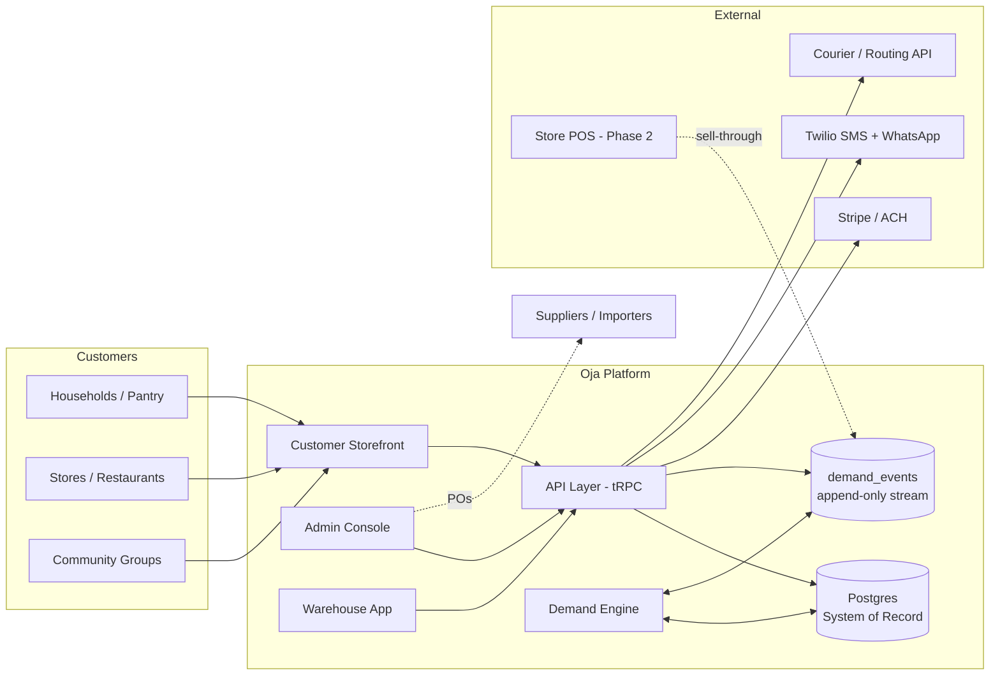
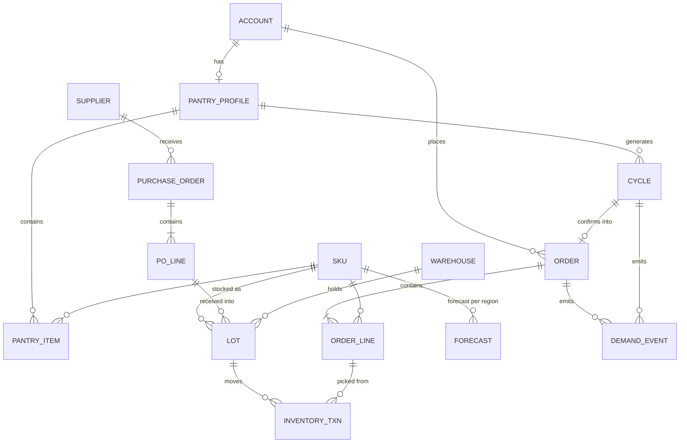
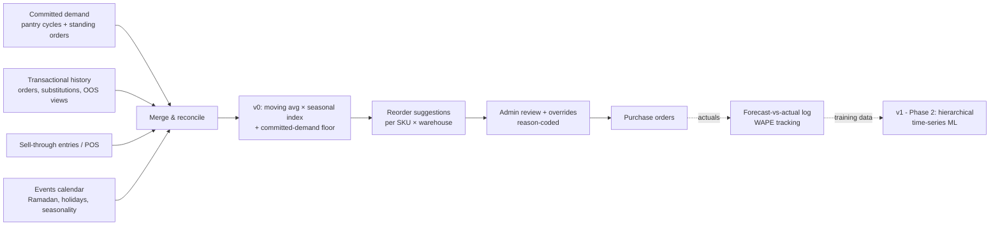
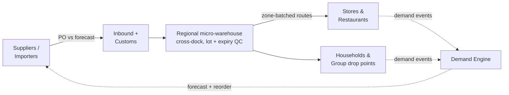

# Oja — Architecture

**Version:** 0.1 (Draft) · **Last updated:** 2026-07-09

System, data, and supply-chain architecture for the Oja platform. Diagrams are Mermaid (render on GitHub).

---

## 1. System Context

One Next.js codebase, three role-gated surfaces (customer / warehouse / admin) over a shared tRPC API and a single Postgres system of record. Every demand-relevant action is _also_ written to an append-only `demand_events` stream — the training substrate for the demand engine.

## 2. Core Services (modular monolith at MVP)

| Module          | Responsibility                                                                                        |
| --------------- | ----------------------------------------------------------------------------------------------------- |
| `catalog`       | SKUs, taxonomy, local-name synonyms, compliance fields, perishability class, substitution graph       |
| `accounts`      | Auth, roles (household/store/restaurant/community/warehouse/admin), B2B verification, net-terms state |
| `orders`        | Cart, checkout, group orders, standing-order templates, order lifecycle                               |
| `pantry`        | Pantry profiles, cadence scheduling, cycle-confirm flow, skip/edit capture                            |
| `inventory`     | Ledger (receive→QC→putaway→pick→ship), lots, expiry, FEFO, recall queries                             |
| `procurement`   | Suppliers, POs, expected arrivals, receiving reconciliation, fast-pay terms                           |
| `fulfillment`   | Wave planning, pick lists, packing, zone/window batching, courier dispatch, tracking                  |
| `demand-engine` | Nightly forecast batch, reorder suggestions, override log, forecast-vs-actual metrics                 |
| `pricing`       | Price books (retail/member/wholesale tiers), markdown ladders, promo tagging                          |
| `notifications` | SMS/WhatsApp/email templates, delivery status, cycle-confirm nudges                                   |

Split-out order when scale demands: demand-engine (first — Python/ML in Phase 2), then fulfillment.

## 3. Data Model (core entities)

Key invariants:

- **Inventory is a ledger, not a counter** — stock on hand is derived from immutable `INVENTORY_TXN` rows; enables audit + recall.
- **Lot + expiry on every unit** of perishable classes; FEFO enforced at pick-list generation.
- **`DEMAND_EVENT` is append-only** and captures _intent_, not just transactions: cycle confirms, skips, edits, substitution acceptances, out-of-stock page views.
- **Forecast rows are never overwritten** — new runs insert versioned rows; overrides reference the row they adjust, with reason codes.

## 4. Demand Engine

v0 is deliberately simple: committed demand (contractual floor) + trailing consumption (statistical layer) + manual category judgment (override layer). Every prediction and override is logged so v1 ML has clean training data with human-decision labels.

## 5. Supply-Chain Flow

JIT posture: micro-warehouse holds ~1–2 weeks of forecasted demand for staples (thin safety stock), near-zero holding for fresh (cross-docked against confirmed cycles). Committed-demand share is the control variable — the higher it is, the leaner the network safely runs.

## 6. Infrastructure & Ops

- **Runtime:** Vercel or Fly.io; managed Postgres (Neon/Supabase) with PITR backups; nightly forecast job as scheduled worker.
- **Auth & access:** role-based; warehouse devices on scoped accounts; admin actions audit-logged.
- **Payments:** Stripe (cards) + ACH for B2B; no card data touches Oja servers (PCI SAQ-A).
- **Observability:** Sentry + structured logs; business-metric dashboard (stockout rate, spoilage, WAPE, cycle-confirm) treated as production monitoring, not just BI.
- **Degradation policy:** order capture must survive downstream outages — checkout writes queue durably; fulfillment/courier sync retries idempotently.
- **Food-safety queries:** recall path (`lot → orders → customers`) is an indexed, tested query with a runbook — drill quarterly.

## 7. Phase Evolution

| Phase   | Architectural change                                                                                                                       |
| ------- | ------------------------------------------------------------------------------------------------------------------------------------------ |
| 1 (MVP) | Modular monolith, one warehouse, forecast v0 in TypeScript                                                                                 |
| 2       | Python demand-engine service (ML v1); POS ingestion webhooks; multi-warehouse inventory + transfer orders                                  |
| 3       | Container-consolidation planner over aggregate forecasts; markdown-pricing engine; Canada region (data residency + CFIA compliance fields) |
| 4       | Store-node APIs (white-label replenishment, pickup-point inventory); supplier financing ledger                                             |
