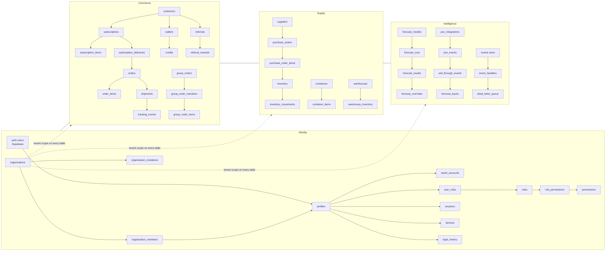
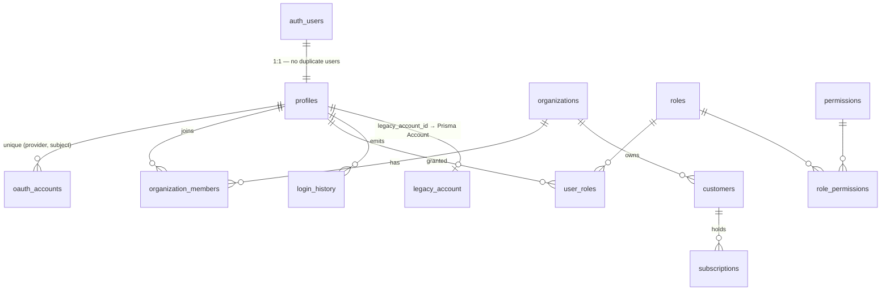

# Canonical Schema — ERD & Database Diagram

123 tables across 18 domains, one convention: every table carries
`id (uuid) · created_at · updated_at · deleted_at · organization_id · created_by · updated_by`,
an `updated_at` trigger, RLS, and indexed FKs (enforced mechanically by
migration 0001 §Z and proven by `npm run canonical:verify`).

## Domain map

## Identity core (key relationships)

## Convergence map (legacy Prisma app schema → canonical)

| Legacy (Prisma, `oja_dev`) | Canonical (`public`, Supabase)                           |
| -------------------------- | -------------------------------------------------------- |
| `Account`                  | `profiles` (+ `customers` / `business_accounts` by role) |
| `Sku`                      | `products` + `product_variants`                          |
| `Subscription`, `Cycle`    | `subscriptions`, `subscription_deliveries`               |
| `Order`, `OrderLine`       | `orders`, `order_items`                                  |
| `Lot`, `InventoryTxn`      | `inventory`, `inventory_movements`                       |
| `PurchaseOrder`, `PoLine`  | `purchase_orders`, `purchase_order_items`                |
| `Forecast` (+ overrides)   | `forecast_runs`/`forecast_results`/`forecast_overrides`  |
| `DemandEvent`              | `events` (canonical event store) + `sell_through_events` |
| `GroupOrder*`              | `group_orders`/`group_order_members`/`group_order_items` |
| `WholesaleLead`            | `waitlists (kind='wholesale')` → `business_accounts`     |
| `NotificationLog`          | `notifications` + channel queues                         |

Identity is live on the canonical schema today (`profiles.legacy_account_id`
bridges both worlds); commerce tables migrate domain-by-domain behind it.
