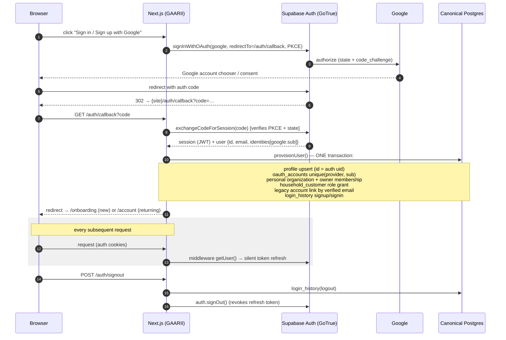

# Google OAuth Flow (Supabase Auth, PKCE)

**No duplicate users, by construction:** `profiles.id` = Supabase auth uid
(1:1), `oauth_accounts` is unique on `(provider, provider_subject)`, Supabase
itself keys OAuth users by verified email, and provisioning is a single
idempotent transaction (replay-safe — proven in
`tests/canonical/provisioning.test.ts`).

**Environments:** the redirect base resolves `NEXT_PUBLIC_SITE_URL` →
`VERCEL_URL` (previews) → `http://localhost:3000`, and the `next` parameter
only accepts same-site relative paths (open-redirect guard, unit-tested).
